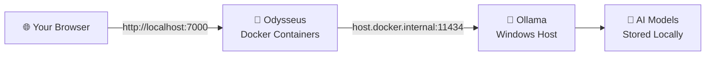

# Odysseus AI Workspace Guide

## What is Odysseus?

Odysseus is a **self-hosted AI assistant platform** — think of it as your own private version of ChatGPT, running entirely on your computer or your office network. Your conversations and documents never leave your machines.

You can chat with AI models, attach files, search through documents, and switch between different AI models — all through a web browser, with no subscription or internet connection required for the AI itself.

---

## How it Works



| Component | What it does |
|---|---|
| **Your browser** | How you talk to Odysseus |
| **Odysseus containers** | The application layer — chat UI, document storage, user accounts |
| **Ollama** | Runs the AI language models on your hardware |
| **AI models** | The brains — stored locally, never uploaded anywhere |

---

## Deployment Modes

Choose during installation based on how your team wants to use Odysseus.

| | Local | Local + Host | Remote |
|---|---|---|---|
| **Who runs Odysseus** | You | You | A colleague |
| **Who can connect** | Only you | You + anyone on the office network | Only you (connecting to the host) |
| **Hardware needed** | Your GPU/CPU | Your GPU/CPU | None (host does the work) |
| **Best for** | Personal use | Team sharing | Offices with a dedicated AI workstation |

> **Local + Host** requires the host machine to be on and running Odysseus for colleagues to connect. The installer automatically adds a Windows Firewall rule to allow inbound connections on port 7000.

---

## First-Time Login

When you launch Odysseus for the first time, the installer generates a random admin password and prints it in the terminal window.

1. Watch the terminal — you will see output like:
   ```
   Your unique generated admin password is listed below:
   --------------------------------------------------------
   password: AbCdEfGhIjKl1234
   --------------------------------------------------------
   Copy this password. You will need it to log in now!
   ```
2. Copy the password.
3. Press **Enter** in the terminal — your browser will open at `http://localhost:7000`.
4. Log in with the admin password you copied.
5. You can change the password and add other users from the admin panel once you're in.

> **Connecting remotely?** Ask whoever hosts Odysseus for the password — they will see it in their terminal during first launch.

---

## Using the Workspace

### Starting a conversation

1. Open `http://localhost:7000` in your browser.
2. Click **New Chat** in the sidebar.
3. Type your message and press **Enter** (or click the send button).

### Picking an AI model

Odysseus connects to Ollama, which can run many different models. To switch:

1. Open or start a chat.
2. Click the model name shown at the top of the chat window.
3. Select a different model from the list.

> Not seeing any models? Open a terminal and run `ollama pull llama3` (or any other model name from [ollama.com/library](https://ollama.com/library)) to download one.

### Attaching documents

You can give the AI a file to read and reason about:

1. In the chat input area, click the **paperclip / attachment icon**.
2. Select a file (PDF, Word document, plain text, etc.).
3. Ask a question about the file in the same message.

### Managing chat history

Your conversations are saved automatically. You can:
- Browse past chats in the left sidebar.
- Rename a chat by clicking on its name.
- Delete a chat using the three-dot menu next to it.

---

## GPU vs CPU Mode

| | GPU (NVIDIA) | CPU only |
|---|---|---|
| **Response speed** | Fast — typically a few seconds per reply | Slower — can take 20–60+ seconds per reply depending on your CPU |
| **Model size** | Can run larger, more capable models | Best to use smaller/quantised models |
| **Setup** | Automatic if an NVIDIA GPU is detected | Automatic fallback if no NVIDIA GPU is found |

The installer detects your GPU automatically. If no NVIDIA GPU is found, you will see a warning during installation — you can still proceed and use Odysseus in CPU mode.

---

## Network Sharing (Host Mode)

If you chose **Local + Host** during installation, colleagues on the same office network can connect to your Odysseus instance.

**To find your IP address:**
1. Open a terminal (Win + R → type `cmd` → Enter).
2. Run: `ipconfig`
3. Look for your **IPv4 Address** under your active network adapter (e.g. `192.168.1.45`).

**Share with colleagues:**
Give them the address: `http://192.168.1.45:7000` (replace with your actual IP).

They can install Odysseus themselves and choose **"Connect to a shared instance"** in the wizard, entering your IP — this creates a desktop shortcut that opens directly to your machine.

> Your machine must be on and Odysseus must be running for colleagues to connect.
